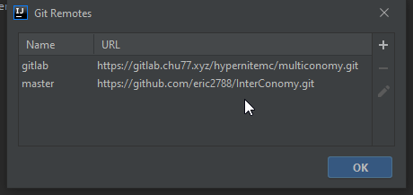
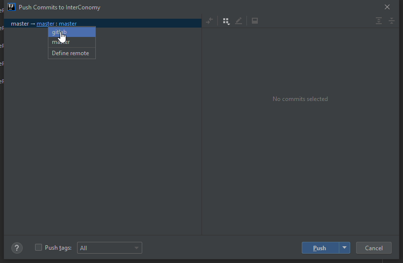

# 如何在 Jetbrains IDE 使用 Gitlab

[請先參考這裏關於如何啟用 Jetbrains VCS 功能](https://www.jetbrains.com/help/idea/enabling-version-control.html#associate_directory_with_VCS)

啟用 VCS 後，先到 Github 創建 Project, 然後獲得 Clone 連結。

然後到 VCS tab -&gt; Git -&gt; Remotes 添加 gitlab 分支。

之後就可以開始 Commit 了。

最後選擇 gitlab 分支, 然後選擇 push。

